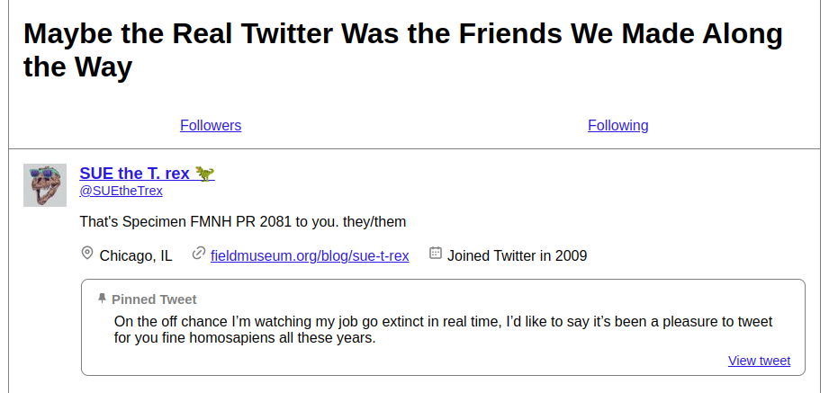

# Tweep Shrine

> Maybe the real Twitter was the friends we met along the way.

I was not ready to leave Twitter. I found myself mourning not my own tweets (which Twitter was only too happy to give me), but the *people* I met on the site. I wanted to know how to reach them. I wanted to preserve a small snippet of what my social circle looked like. So I built off the awesome [unflwrs](https://github.com/Syfaro/unflwrs) service that [@Syfaro](https://github.com/Syfaro) created, and created a standalone HTML file which displays every user profile and pinned tweet.

I share this “shrine” with y’all in the hopes that it provides some solace to you as well.

The shrine is an HTML page will dynamically create user lists from the tweeps data that `unflwrs` has helpfully archived for you. For each friend or follower, you’ll see:

* their profile pic,
* their name,
* their Twitter handle,
* if their tweets are protected,
* their user description,
* their set location (if provided),
* their website (if provided),
* the year they joined Twitter, and
* their pinned tweet (if provided).

The result looks like this:

## A note on privacy

**Important:** You are free to download, edit, modify, whatever to the shrine HTML. I ask only that you do **not** use it to publish your tweeps’ data online. Keep it for your own records; open it and smile at the memories, or sigh at what was lost. But *please* allow your friends and followers control over their own online presence. **Don’t publish their info.**

## How to load your tweeps

1. Get your data!
    1. Visit the [unflwrs Twitter follower tracker](https://unflwrs.syfaro.com/).
    2. Select the option to “download profile pictures”.
    3. Select the option to “export json instead of csv”.
    4. Click the button “friends &amp; followers export”.
    5. Twitter will ask if you want to authorize the application to access your data. Click “Authorize app”.
    6. Back on the tracker site, click “start”.
    7. When prompted, save the zip file to your computer.
2. Extract everything from the zip file. (On many operating systems, double-clicking or “opening” the zip file will start the extraction process.)
3. Save [this HTML file](https://raw.githubusercontent.com/amclark42/tweep-shrine/main/shrine.html) into the same directory as your extracted data.
4. Prepare the list of *your followers*:
    1. Use a text editor (<strong>not</strong> Microsoft Word) to open the file “followers.json”.
    2. Before the first bracket, paste this: <pre><code>const followers = </code></pre>
    3. In your editor’s File menu, select “Save As...”
    4. Save the copy to the same directory, with the name “followers.js”. Make sure the editor doesn’t try to tack “.json” on at the end.
5. Prepare the list of *users you follow*:
    1. Use a text editor (<strong>not</strong> Microsoft Word) to open the file “following.json”.
    2. Before the first bracket, paste this: <pre><code>const following = </code></pre>
    3. In your editor’s File menu, select “Save As...”
    4. Save the copy to the same directory, with the name “following.js”. Make sure the editor doesn’t try to tack “.json” on at the end.
6. Open the saved HTML file in your browser!
