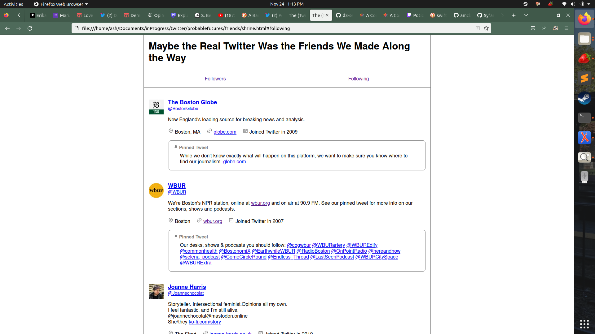

# Tweep Shrine

> Maybe the real Twitter was the friends we met along the way.

The archive that Twitter provided me was okay for my own tweets, but for my friends and followers? The user data they provide is wholly dependent on the Twitter servers being up, the user accounts being public (not locked against guests) and not deleted.

I was not ready to leave Twitter. I found myself mourning not my own tweets (which Twitter was only too happy to give me), but the people I met on the site. I wanted to know how to reach them. I wanted to preserve a small snippet of what my social circle looked like. So I built off the awesome [unflwrs](https://github.com/Syfaro/unflwrs) service that @Syfaro created, and created a standalone HTML file which displays every user profile and pinned tweet.

This HTML page will dynamically create user lists from the tweeps data that `unflwrs` has helpfully archived for you. The result looks like this:

## How to load your tweeps

1. Get your data!
    1. Visit the [unflwrs Twitter follower tracker](https://unflwrs.syfaro.com/).
    2. Select the option to “download profile pictures”.
    3. Select the option to “export json instead of csv”.
    4. Click the button “friends &amp; followers export”.
    5. Twitter will ask if you want to authorize the application to access your data. Click “Authorize app”.
    6. Back on the tracker site, click “start”.
    7. When prompted, save the zip file to your computer.
2. Extract everything from the zip file. (On many operating systems, double-clicking or “opening” the zip file will start the extraction process.)
3. Save [this HTML file](https://raw.githubusercontent.com/amclark42/tweep-shrine/main/shrine.html) into the same directory as your extracted data.
4. Prepare the list of *your followers*:
    1. Use a text editor (<strong>not</strong> Microsoft Word) to open the file “followers.json”.
    2. Before the first bracket, paste this: <pre><code>const followers = </code></pre>
    3. In your editor’s File menu, select “Save As...”
    4. Save the copy to the same directory, with the name “followers.js”. Make sure the editor doesn’t try to tack “.json” on at the end.
5. Prepare the list of *users you follow*:
    1. Use a text editor (<strong>not</strong> Microsoft Word) to open the file “following.json”.
    2. Before the first bracket, paste this: <pre><code>const following = </code></pre>
    3. In your editor’s File menu, select “Save As...”
    4. Save the copy to the same directory, with the name “following.js”. Make sure the editor doesn’t try to tack “.json” on at the end.
6. Open the saved HTML file in your browser!
